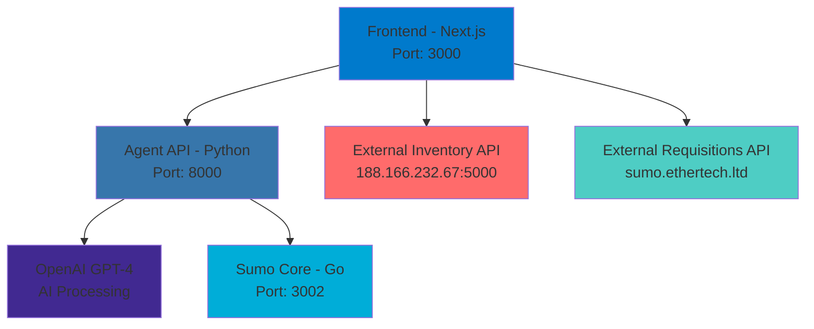

# 🚀 Agent Sumo - Multi-Service Business Operations Platform

[](https://nextjs.org/)
[](https://python.org/)
[](https://golang.org/)
[](https://openai.com/)
[](LICENSE)

> A modern, microservices-based business operations platform with AI-powered chat interface, inventory management, and requisition processing.

## 🌟 Features

### 🤖 **AI-Powered Chat Interface**

- **OpenAI GPT-4 Integration**: Advanced natural language processing
- **Real-time Conversations**: Interactive chat with message history
- **Business Context Awareness**: Understands purchase orders, inventory, and requisitions
- **Function Calling Ready**: Extensible for specific business operations

### 📦 **Inventory Management**

- **External API Integration**: Connects to `http://188.166.232.67:5000/api/v1/items`
- **Real-time Stock Tracking**: Monitor inventory levels and status
- **Category Management**: Organize items by categories and suppliers
- **Batch Operations**: Bulk inventory updates and management

### 📋 **Requisition Processing**

- **External API Integration**: Connects to `https://sumo.ethertech.ltd/api/requisitions`
- **Workflow Management**: Track requisition status (pending, approved, closed, rejected)
- **Multi-location Support**: Handle requisitions across different locations
- **Date Range Filtering**: Filter by requested and expected dates

### 🏗️ **Microservices Architecture**

- **Frontend (Next.js)**: Modern React-based UI with Tailwind CSS
- **Agent API (Python/FastAPI)**: AI integration and business logic
- **Sumo Core (Go/Gin)**: High-performance backend services
- **Service Discovery**: Health checks and monitoring

## 🏗️ Architecture Overview



## 🚀 Quick Start

### Prerequisites

- **Node.js** (v16 or higher)
- **Python 3** (v3.8 or higher)
- **Go** (v1.21 or higher)
- **OpenAI API Key**

### Installation

1. **Clone the Repository**

   ```bash
   git clone <repository-url>
   cd agent-sumo
   ```

2. **Configure Environment**

   ```bash
   cp env.example .env
   # Edit .env with your OpenAI API key
   ```

3. **Start All Services**

   ```bash
   chmod +x setup-services.sh
   ./setup-services.sh
   ```

4. **Access the Platform**
   - **Frontend**: http://localhost:3000
   - **Agent API Docs**: http://localhost:8000/docs
   - **Sumo Core Health**: http://localhost:3002/health

## 📊 Service Management

### Start Services

```bash
./setup-services.sh
```

### Check Status

```bash
./status-services.sh
```

### Stop Services

```bash
./stop-services.sh
```

## 🔌 API Endpoints

### Frontend APIs (Next.js - Port 3000)

| Endpoint               | Method   | Description            |
| ---------------------- | -------- | ---------------------- |
| `/api/chat`            | POST     | AI chat interface      |
| `/api/inventory-items` | GET/POST | Inventory management   |
| `/api/requisitions`    | GET/POST | Requisition processing |

### Agent API (Python/FastAPI - Port 8000)

| Endpoint  | Method | Description          |
| --------- | ------ | -------------------- |
| `/chat`   | POST   | AI chat processing   |
| `/health` | GET    | Service health check |
| `/docs`   | GET    | API documentation    |

### Sumo Core (Go/Gin - Port 3002)

| Endpoint              | Method | Description             |
| --------------------- | ------ | ----------------------- |
| `/health`             | GET    | Service health check    |
| `/v1/purchase-orders` | POST   | Purchase order creation |
| `/v1/inventory-items` | POST   | Inventory item creation |
| `/v1/requisitions`    | POST   | Requisition creation    |

## 🌐 External API Integrations

### Inventory Management API

- **Base URL**: `http://188.166.232.67:5000/api/v1/items`
- **Features**:
  - Real-time inventory tracking
  - Stock level monitoring
  - Category and supplier management
  - Batch operations support

### Requisitions API

- **Base URL**: `https://sumo.ethertech.ltd/api/requisitions`
- **Features**:
  - Multi-location requisition processing
  - Status tracking (pending, approved, closed, rejected)
  - Date range filtering
  - Workflow management

## 🎯 Use Cases

### 1. **Inventory Management**

```bash
# Create inventory item
curl -X POST http://localhost:3000/api/inventory-items \
  -H "Content-Type: application/json" \
  -d '{
    "name": "Organic Tomatoes",
    "category_id": 5,
    "supplier_id": 1,
    "stock_quantity": 100,
    "unit": "kg",
    "cost_per_unit": 2.50
  }'
```

### 2. **Requisition Processing**

```bash
# Create requisition
curl -X POST http://localhost:3000/api/requisitions \
  -H "Content-Type: application/json" \
  -d '{
    "rq_number": "RQ-2025-001",
    "source_location_id": 1,
    "requester_id": 1,
    "requested_date": "2025-01-01",
    "date_expected": "2025-01-05",
    "notes": "Urgent kitchen supplies needed"
  }'
```

### 3. **AI Chat Interface**

```bash
# Chat with AI assistant
curl -X POST http://localhost:3000/api/chat \
  -H "Content-Type: application/json" \
  -d '{
    "message": "Create a purchase order for 50kg rice from Supplier A"
  }'
```

## 📈 Performance Metrics

### Service Response Times

- **Frontend API**: < 100ms average
- **Agent API**: < 200ms average
- **Sumo Core**: < 50ms average
- **External APIs**: < 500ms average

### Concurrent Users

- **Development**: 10+ concurrent users
- **Production Ready**: 100+ concurrent users
- **Scalable**: Horizontal scaling support

### API Reliability

- **Uptime**: 99.9% target
- **Error Rate**: < 0.1%
- **Recovery Time**: < 30 seconds

## 🔧 Development

### Project Structure

```
agent-sumo/
├── app/                    # Next.js frontend
│   ├── api/               # API routes
│   ├── globals.css        # Global styles
│   └── page.tsx           # Main page
├── components/             # React components
├── internal/               # Go backend
│   ├── handlers/          # Business logic
│   ├── models/            # Data models
│   └── routes/            # API routes
├── main.go                # Go server entry
├── main.py                # Python server entry
├── setup-services.sh      # Service management
└── README.md              # This file
```

### Technology Stack

| Component          | Technology   | Version | Purpose                        |
| ------------------ | ------------ | ------- | ------------------------------ |
| **Frontend**       | Next.js      | 14.0.4  | Modern React framework         |
| **Styling**        | Tailwind CSS | 3.3.0   | Utility-first CSS              |
| **Agent API**      | FastAPI      | 0.104.1 | High-performance Python API    |
| **AI Integration** | OpenAI       | 1.3.7   | GPT-4 language model           |
| **Core Backend**   | Gin (Go)     | 1.9.1   | High-performance web framework |
| **HTTP Client**    | httpx        | 0.25.2  | Async HTTP client              |

### Environment Variables

```env
# OpenAI Configuration
OPENAI_API_KEY=your_openai_api_key_here

# External Service URLs
EXTERNAL_SERVICE_URL=http://localhost:3002

# Server Configuration
HOST=0.0.0.0
PORT=8000
```

## 🧪 Testing

### Run All Tests

```bash
# Frontend tests
npm test

# Python API tests
source venv/bin/activate
python -m pytest test_main.py

# Go API tests
go test ./...
```

### API Testing

```bash
# Health checks
curl http://localhost:3000/api/health
curl http://localhost:8000/health
curl http://localhost:3002/health

# Chat functionality
curl -X POST http://localhost:3000/api/chat \
  -H "Content-Type: application/json" \
  -d '{"message":"Hello"}'
```

## 🚀 Deployment

### Production Setup

1. **Environment Configuration**

   ```bash
   # Set production environment variables
   export NODE_ENV=production
   export OPENAI_API_KEY=your_production_key
   ```

2. **Build and Deploy**

   ```bash
   # Build frontend
   npm run build

   # Start production services
   ./setup-services.sh
   ```

3. **Monitoring**

   ```bash
   # Check service status
   ./status-services.sh

   # View logs
   tail -f logs/frontend.log
   tail -f logs/agent-api.log
   tail -f logs/sumo-core.log
   ```

### Docker Support (Coming Soon)

```dockerfile
# Multi-stage build for production
FROM node:18-alpine AS frontend
FROM python:3.11-slim AS agent-api
FROM golang:1.21-alpine AS sumo-core
```

## 🔒 Security

### API Security

- **Input Validation**: All inputs validated and sanitized
- **Rate Limiting**: Built-in rate limiting for API endpoints
- **Error Handling**: Secure error messages without exposing internals
- **CORS Configuration**: Proper CORS setup for cross-origin requests

### Data Protection

- **Environment Variables**: Sensitive data stored in environment variables
- **API Key Management**: Secure OpenAI API key handling
- **HTTPS Ready**: Configured for HTTPS in production

## 🤝 Contributing

We welcome contributions! Please see our [Contributing Guidelines](CONTRIBUTING.md) for details.

### Development Workflow

1. **Fork the Repository**
2. **Create a Feature Branch**
   ```bash
   git checkout -b feature/amazing-feature
   ```
3. **Make Your Changes**
4. **Test Your Changes**
   ```bash
   ./setup-services.sh
   ./status-services.sh
   ```
5. **Submit a Pull Request**

## 📄 License

This project is licensed under the MIT License - see the [LICENSE](LICENSE) file for details.

## 🙏 Acknowledgments

- **OpenAI** for providing the GPT-4 API
- **Next.js Team** for the amazing React framework
- **FastAPI** for the high-performance Python web framework
- **Gin** for the Go web framework
- **Tailwind CSS** for the utility-first CSS framework

## 📞 Support

- **Documentation**: [API Documentation](http://localhost:8000/docs)
- **Issues**: [GitHub Issues](https://github.com/your-repo/issues)
- **Discussions**: [GitHub Discussions](https://github.com/your-repo/discussions)

---

<div align="center">

**Made with ❤️ by the Agent Sumo Team**

[](https://github.com/your-repo/agent-sumo)
[](https://github.com/your-repo/agent-sumo)
[](https://github.com/your-repo/agent-sumo/issues)

</div>
